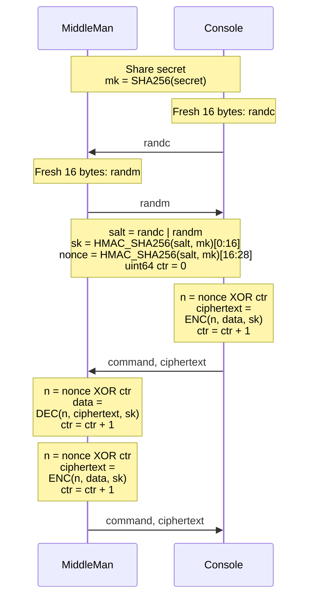

## MiddleMan 控制协议

### Packet Format

* **字节序：** Little-Endian

* **包格式：**
  
    | 字段                  | 大小    |
    | --------------------- | ------- |
    | Command Code 命令码   | 1 byte  |
    | Data Length  数据长度 | 4 bytes |
    | Data 数据             | n bytes |

### Command Code

1. **0x01: Exchange Random**

   | Code | Length | Data         |
   | ---- | ------ | ------------ |
   | 0x01 | 16     | random vaule |
   
2. **0x02: Update Data**

   **密文：**

   | Code | Length | Data           |
   | ---- | ------ | -------------- |
   | 0x02 | n      | encrypted data |

   **明文：**

   | Code | Length | Type (1 byte) | Data (n - 1 byte) |
   | ---- | ------ | ------------- | ----------------- |
   | 0x02 | n      | date type     | data              |

   **Date type:** 不足16字节用0x01补齐

   * 0x01: 证书数据 JSON { "ROOT_CA_CERT": "xxx", "INTERMEDIATE_CA_KEY": "xxx", "INTERMEDIATE_CA_CERT": "xxx" } (证书/密钥内容为PEM格式)
   * 0x02: 监听端口 UINT16 小端
   * 0x03: 数据库信息 JSON { "DB_HOST": "xxx", "DB_PORT": 0000, "DB_NAME": "xxx", "DB_USER": "xxx", "DB_PASS": "xxx" }

   注: JSON 数据需要使用 UTF-8 编码 `json.dumps(data).encode("utf-8")`

3. **0x03: Request Data**
   
   **密文：**同上
   
   **明文：**
   
   | Code | Length | Type (1 + 15 bytes)   |
   | ---- | ------ | --------------------- |
   | 0x03 | 16     | date type  + 0x01* 15 |
   
   **Date type:** 同上
   
4. **0x04: Start**

   **密文：**同2
   
   **明文：**
   
   | Code | Length | Data (5 + 11 bytes) |
   | ---- | ------ | ------------------- |
   | 0x04 | 16     | b"START" + 0x01* 11 |
   
5. **0x05: Stop**

   **密文：**同2
   
   **明文：**
   
   | Code | Length | Data (4 + 12 bytes) |
   | ---- | ------ | ------------------- |
   | 0x05 | 16     | b"STOP" + 0x01* 12  |
   
6. **0xFF: Error**

   | Code | Length | Data          |
   | ---- | ------ | ------------- |
   | 0xFF | n      | error message |

###  协议流程

ENC:  AES-128-GCM encrypt

DEC:  AES-128-GCM decrypt

